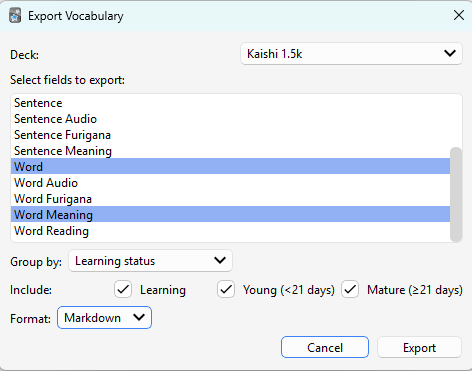

# Anki Vocab Exporter

An Anki addon that exports your known vocabulary to Markdown. Words are grouped by maturity level (Learning, Young, Mature) based on your review history.

*This is a personal tool shared as-is. I don't publish it to the official Anki addon repo because I'd rather not maintain it. Feel free to fork and adapt it to your needs.*


## Export Format

**Markdown**: Words are grouped by maturity level in CSV format. Works well as input for LLMs to generate example sentences or quizzes using only words you already know.
```
## Added Today

Word,Word Meaning
信じる,"to&nbsp;believe, to&nbsp;trust"
自分,"self, oneself"

## Fresh

Word,Word Meaning
君,you (to someone of equal or lower status)
本当,"truth, reality"

## Young

Word,Word Meaning
あなた,you (usually when one doesn't know the person)
彼,"he, him"

## Mature

Word,Word Meaning
日本語,Japanese language
本,book
```

## Usage
Call via `Deck Settings > Export Vocabulary`




## Installation

1. Download this repository as a ZIP (Code > Download ZIP)
2. Extract the ZIP and find the `plugin` folder
3. Rename `plugin` to `AnkiVocabExporter`
4. Compress `AnkiVocabExporter` into a new ZIP file
5. In Anki: Tools > Add-ons > Install from File, select the ZIP


## Development

Run `python link.py` to create a directory link to the Anki addons folder. Restart Anki to load changes.